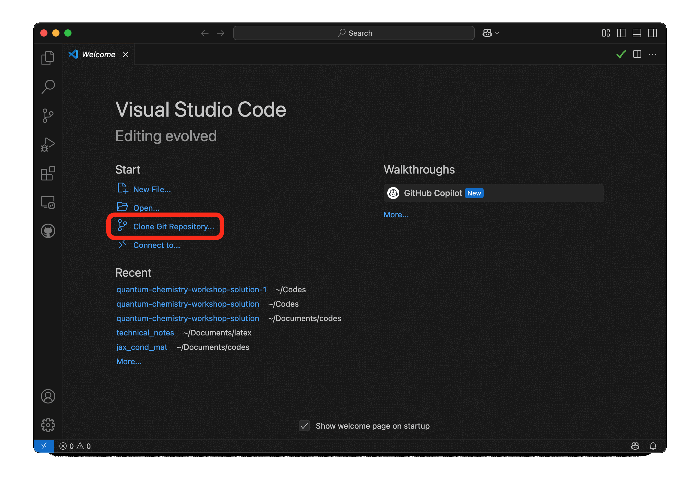

# quantum-chemistry-workshop-solution

## Quick-start

### Option 1: VS Code

### Option 2: venv + pip

Clone the repository to your computer

    git clone https://github.com/algolab-quantique/quantum-chemistry-workshop-solution.git
    cd quantum-chemistry-workshop-solution

Create and activate a virtual environment

    python -m venv .venv
    source .venv/bin/activate

Install as an editable module (with dependencies)

    pip install -e .

Open the tutorial notebook

    jupyter notebook notebooks/guided_tutorial_1.ipynb 

### Option 3: Conda (more detailed instructions)

This is almost the same as option 2, but with more explanations.

If you are new to python virtual environements, we suggest you use `conda`. You can [install conda or miniconda on your computer](https://docs.conda.io/projects/conda/en/latest/user-guide/install/index.html).

Then, you can download the content of this tutorial either by getting the zip file, or by by cloning the repository to your computer

    git clone https://github.com/algolab-quantique/quantum-chemistry-workshop-solution.git
    cd quantum-chemistry-workshop-solution

Once this, create a conda environnement.

    conda create -n workshop2025 python=3.12
    conda activate workshop2025

To simplify importation of all dependencies, we recommend to install the current `quantum_chemistry` package with the *editable* option. To do so, open a terminal at the location of the `pyproject.toml` file. Then type 

    pip install -e .
    
This will ensure that you don't need to reinstall it everytime you make a modification to any of the `.py` file.
